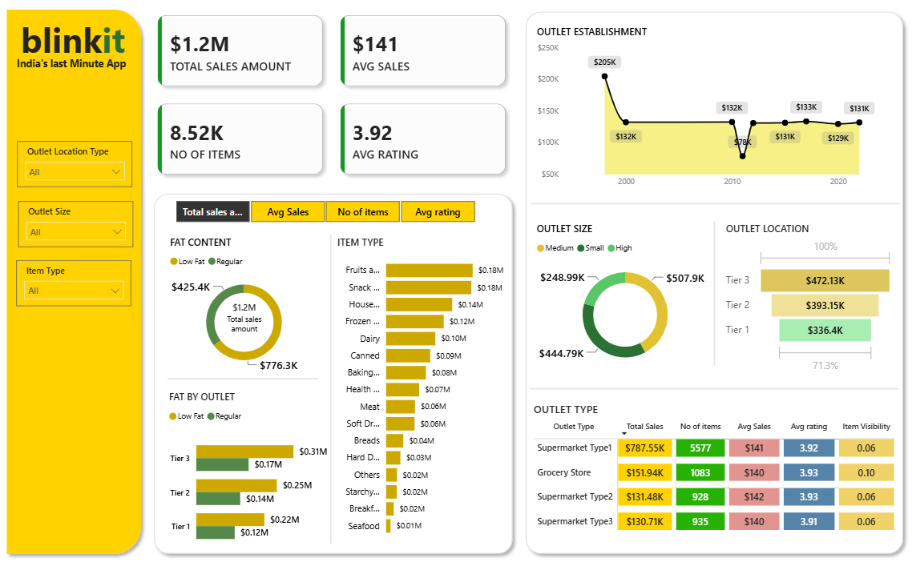
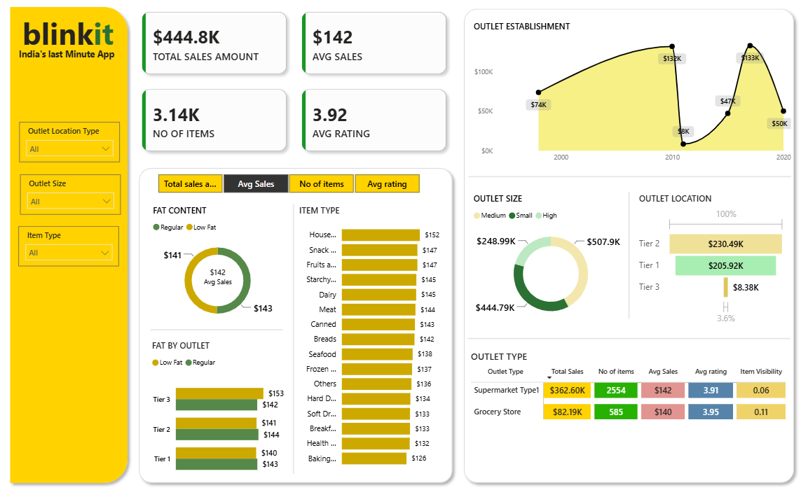
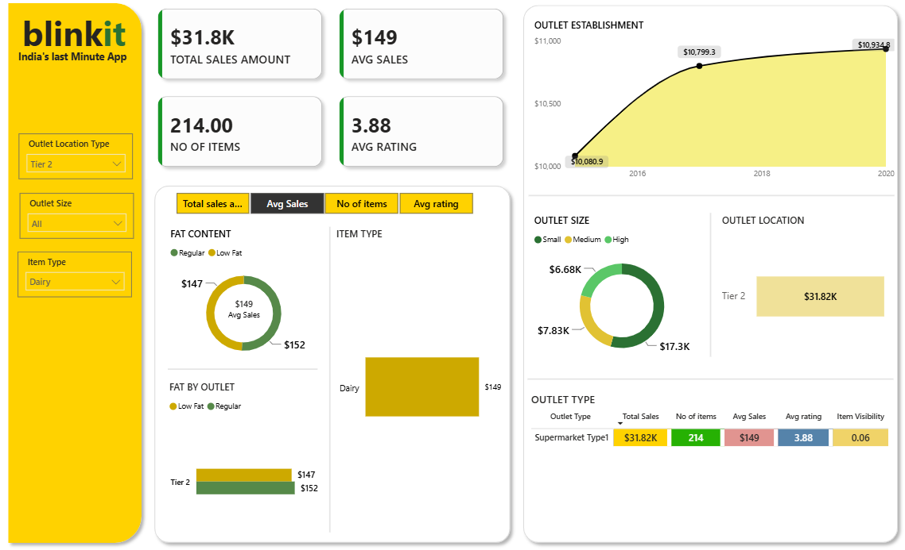
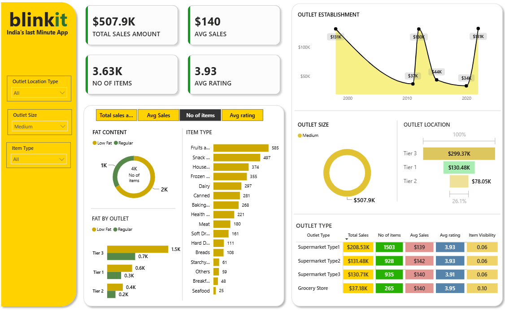

# 🛒 BlinkIT Grocery Sales Analysis

## 📌 Overview

This project presents an end-to-end data analytics workflow using the BlinkIT Grocery Sales dataset. The analysis begins with data cleaning and exploratory data analysis (EDA) in **Python**, followed by the development of an interactive **Power BI dashboard** to visualize key business insights.

The objective is to identify sales trends, customer preferences, and product performance to support data-driven decision-making.

---

## 📊 Project Workflow

```
Raw Dataset
      │
      ▼
Data Cleaning (Python)
      │
      ▼
Exploratory Data Analysis (Python)
      │
      ▼
Cleaned Dataset
      │
      ▼
Interactive Dashboard (Power BI)
```

---

## 🛠️ Tools & Technologies

- Python
- Pandas
- NumPy
- Jupyter Notebook
- Power BI
- Git & GitHub

---


### Cleaning Tasks Performed

- Removed missing values from **Item Weight** using the median.
- Standardized inconsistent values in **Item Fat Content**.
- Checked and handled duplicate records.
- Created a new **Visibility Category** feature.
- Prepared the dataset for visualization in Power BI.

---

## 📈 Exploratory Data Analysis (EDA)

Performed exploratory analysis using Python to understand sales patterns and product characteristics.

### Key Analyses

- Distribution of Total Sales
- Item Visibility Analysis
- Fat Content Distribution
- Outlet Establishment Trends
- Sales by Item Type
- Sales by Outlet Size
- Sales by Outlet Location
- Outlet Type Performance
- Correlation between numerical features

---

## 📊 Power BI Dashboard

An interactive dashboard was developed to present business insights through dynamic visualizations.

### Dashboard Features

- KPI Cards
  - Total Sales
  - Average Sales
  - Average Rating
  - Number of Items

- Visualizations
  - Sales by Item Type
  - Sales by Outlet Location
  - Sales by Outlet Size
  - Sales by Outlet Type
  - Outlet Establishment Trend
  - Fat Content Analysis
  - Item Visibility Analysis

---

## 📌 Key Business Insights

- Generated $1.20M in total sales from 8,523 items, with an average customer rating of 3.92.
- Supermarket Type1 was the top-performing outlet, contributing $787.55K in total sales.
- Tier 3 outlets recorded the highest sales ($472.13K), making them the most profitable location category.
- Medium-sized outlets generated the highest revenue ($507.9K) compared to small and large outlets.
- Low Fat products outperformed Regular products, contributing $776.3K in sales.
- Fruits & Vegetables and Snack Foods were the best-selling product categories, each generating approximately $0.18M in sales.

---

## 📂 Project Structure

```
BlinkIT-Grocery-Analysis/
│
├── Data/
│   ├── BlinkIT Grocery Data.csv
│   └── BlinkIT_Cleaned.csv
│
├── Python/
│   └── BlinkIT_EDA.ipynb
│
├── PowerBI/
│   └── BlinkIT Dashboard.pbix
│
├── Images/
│   ├── dashboard.png
│   ├── img1.png
│   ├── img2.png
│   └── ...
│
└── README.md
```

---

## 🚀 Skills Demonstrated

- Exploratory Data Analysis
- Data Visualization
- Business Insight Generation
- Python Programming
- Power BI
- GitHub Project Documentation

---

## 📷 Dashboard Preview

#### Total Sales Analysis


#### Small Outlet Average Sales Dashboard


#### Average Sales Analysis for Dairy Products in Tier 2 Outlets


#### Medium-Sized Outlet Item Distribution Dashboard

---

## 🔮 Future Improvements

- Build predictive sales forecasting models.
- Deploy an interactive dashboard using Streamlit.
- Connect Power BI to a live SQL database.
- Automate the ETL pipeline using Python.

---

## 👩‍💻 Author

**Rishita Baranwal**

Aspiring Data Analyst | Python | Power BI | SQL

GitHub: [Github](https://github.com/Rishita877)
